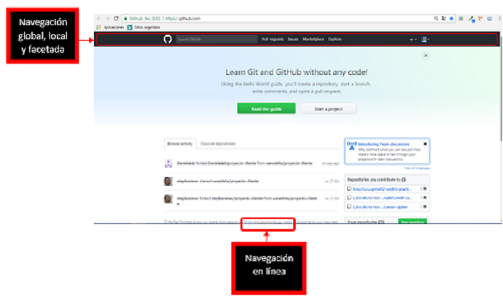
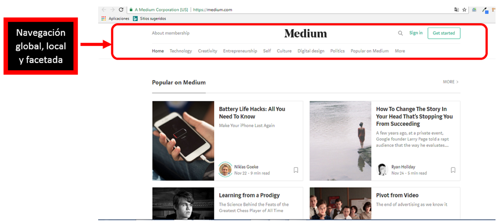

## 2. Identifica los elementos de navegación en los siguientes sites

### BREATHER
Identififcando los elementos de navegacion en la pagina de Breather

+ Navegacion global

+ Navegacion local

### GITHUB
Identificando los elementos de navegacion en la pagina de Github

### MEDIUM
Identificando los elementos de navegacion en la pagina de Medium

