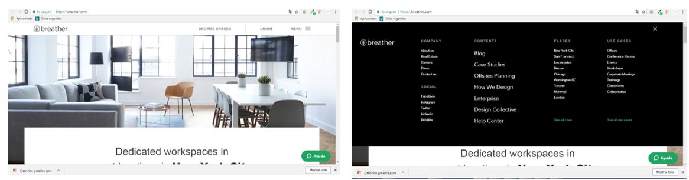

## 2. Identifica los elementos de navegación en los siguientes sites

### BREATHER
Identififcando los elementos de navegacion en la pagina de Breather

+ Navegacion global
- Las opciones de navegacion global estan en su MENU hamburguesa
- En la seccion del header tambien encontramos a browse space que seria la navegacion faceteada

+ Navegacion local
- Dentro del menu hamburguesa encontramos muchas opciones entrando a una de ellas estaremos en una navegacion local

### GITHUB
Identificando los elementos de navegacion en la pagina de Github

### MEDIUM
Identificando los elementos de navegacion en la pagina de Medium

